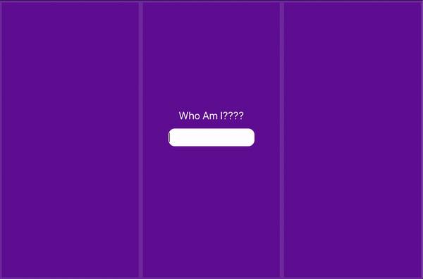

Welcome to a demonstration of global state managament using Recoil.js. 

To see it in action:
- clone the repository
- cd into the cloned file
- run "npm start" in your terminal
- enter text into the input and see it shown across three sibling components. 

Follow along the guide to building this demonstration on my blog:

### `yarn start`

Runs the app in the development mode. 
Open [http://localhost:3000](http://localhost:3000) to view it in the browser.

The page will reload if you make edits. 
You will also see any lint errors in the console.

